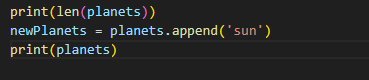

<h1>Python Lists</h1>
    <ol type="1">
        <li><b>list</b> can be made using brackets []</li>
        <li>You can access an item of a list using an <b>index</b></li>
        <li>You can change a value of an item in the list by example planets[0] = 'mars', this will replace the item on index 0 with mars.</li>
        <li><b>len()</b> this <b>built in function</b> provides the number of items in a list.</li>
        <li><b>append</b> method allows you to add an item towards the <b>end of a list.  
        </b></li>
        <li><b>pop()</b> method allows you to remove an item from the end of the list, but you need to store it inside a variable, then print it to show what was removed.</li>
        <li><b>Negative indexes</b> allows you to remove the last item of the list, if its -1, -2 indicates the 2nd last item.</li>
        <li><b>min() and max() Functions</b> allows you to print out the minimum and the highest value in the list.</li>
        

</ol>
<h1>Manipulating with lists</h1>
    <ol type="1">
        <li><b>Slice</b> this allows you to remove a certain number of items from a list. It is denoted by [<i>Starting index (Included)</i>: <i>ending index (excluded)</i> ]  
        </li>
        <li><b>join lists</b> you can join a list using a simple concatenation sign <b>+</b></li>
        <li><b>sort()</b> method allows you to sort a list <b>alphabetically</b> and <b>numerically</b></li>
        <li><b>NOTE about sort()</b>, using sort() method modifies the current list. <i>You don't need to store it inside a variable because it is already sorted and remains unchanged. If you store it in a variable, it will give a value of NONE when you try to print that variable. It will give a value of <b>NONE</b> because it doesn't save any value in its <b>temporary memory</b> instead only Sorts the current list.</i></li>
        
</ol>

<h1>Notes and excersices</h1>
    <ol>
        <li></li>
    </ol>